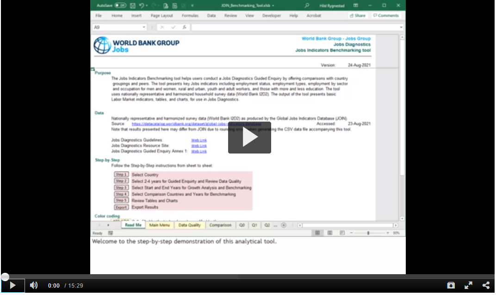

# What is the JObs INdicator (JOIN) Tool?

The JOIN indicator tool enables Excel-based analysis of labor markets with several customization options. The tool uses inputs from the Global Jobs Indicator Database (JOIN) with more granular disaggregations. Users can flexibly choose the country for the analysis, comparator countries, and a timeline. Predefined pivot tables help users to start the exploring the labor market data following the[Jobs Diagnostic Guided Inquiry](https://openknowledge.worldbank.org/bitstream/handle/10986/33491/Theoretical-Underpinnings-of-Jobs-Diagnostics.pdf?sequence=1&isAllowed=y). They can nest the data by several subgroups including gender, urban/rural, age groups, employment status, employment types, sectors, occupations, and education level. 

To enable additional analysis, users can customize these pivot tables, for example, by changing the subgroups of the data set they want to look at from urban versus rural to education level by gender. While the level of analysis is more granular than in JOIN, the sampling approach used in the underlying survey may limit the representativity of the results and needs to be considered. The tool only processes aggregated data to facilitate data sharing and to maintain high data privacy standards.

# How can I access the tool? 

The tool can be downloaded [here](https://development-data-hub-s3-public.s3.amazonaws.com/ddhfiles/160361/join_benchmarking_tool.zip). 

# How do I use the tool? 

The tool is easy to use and the only thing you will need is Excel. This video shows you how to store your files and conduct an analysis (click on the screenshot to be taken to the video hosting site): 

# Can I add surveys on my own? 
Yes, this is possible. The additional household surveys would need to follow the I2D2/GMD/GLD normenclature. With the household surveys in I2D2/GMD/GLD format, you can run the do-file of this GitHub project to process the survey and obtain the input for the JObs-INdicator tool. You will need four other datasets that are stored in the Data folder to successfully run the code. Please save them in one Data folder and then follow the instructions in the do-file. 
